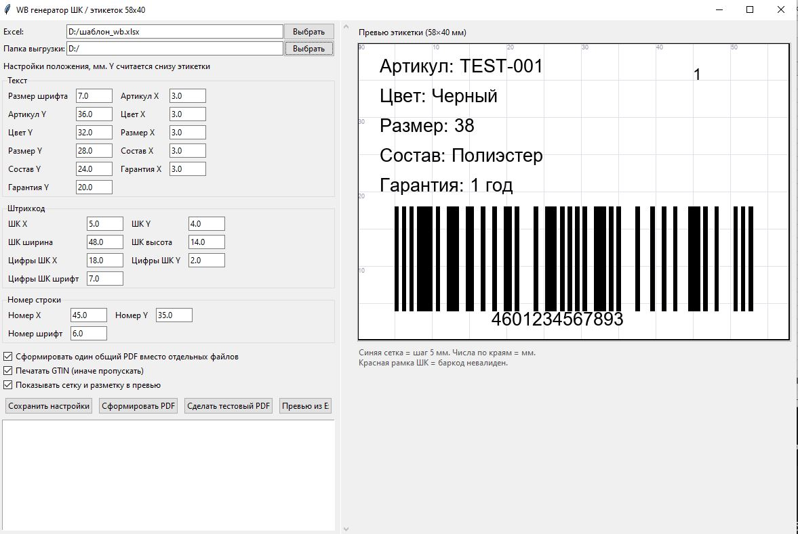
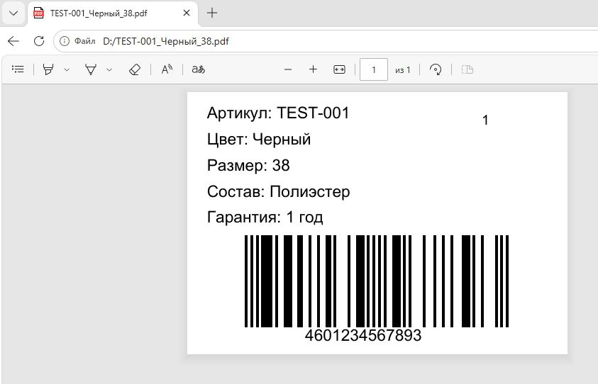

# wb-barcode-gui

Десктоп-утилита на Python для печати этикеток **58×40 мм** со штрихкодом **EAN-13** из Excel-выгрузки Wildberries.



## Возможности

- Чтение Excel и генерация PDF-этикеток 58×40 мм со штрихкодом EAN-13
- Живое превью этикетки с сеткой и разметкой в миллиметрах
- Поддержка **EAN-13** и **GTIN-14** (14-значные коды с ведущим нулём)
- Автоматическая контрольная цифра: 12 цифр дополняются, 13 — проверяются
- Обработка GTIN: чекбокс «печатать / пропускать»; пропущенные выгружаются в отдельный Excel с подсветкой
- Порядковый номер строки в углу этикетки — для быстрой перепечатки
- Кнопка «Шаблон Excel» — создаёт пустой файл с нужными колонками (Баркод в текстовом формате, без «2E+12»)
- Гибкая настройка позиций всех элементов и сохранение настроек
- Запоминание последних путей (Excel и папка вывода)



## Требования

- Windows, Python 3.11+
- Зависимости: `openpyxl`, `reportlab`, `pillow`

## Установка и запуск

```powershell
python -m venv .venv
.\.venv\Scripts\Activate.ps1
pip install -r requirements.txt
python wb_barcode_gui.py
```

## Формат Excel

Первая строка — заголовки. Обязательные колонки:

`Артикул` · `Артикул WB` · `Цвет` · `Размер` · `Состав` · `Баркод` · `Гарантия`

Готовый шаблон создаёт кнопка «Шаблон Excel» в интерфейсе.

## Лицензия

[MIT](LICENSE)